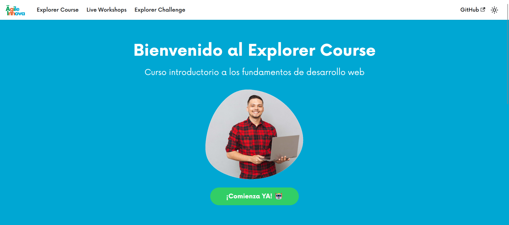

<h1 align="center">
  <br/>
  Explorer Course
</h1>
<p align="center">¡Bienvenido a nuestro Explorer Course 😊, desde Agile Innova Academy estamos muy a gusto en que seas parte de nuestra comunidad Agilers!</p>



# Table of contents
* [Deploy](#deploy-📦)
* [Technologies](#technologies-🛠️)
* [Setup](#setup-⚡️)
* [Project structure](#project-structure-📂)
## Deploy 📦
- [Explorer Course](https://agileinnova.github.io/explorer-course-ai/)

## Technologies 🛠️

- [ReactJS v17](https://es.reactjs.org/)
- [Docusaurus v2.1](https://docusaurus.io/)
- [React Big Calendar](https://github.com/jquense/react-big-calendar)

## Setup ⚡️
```
$ git clone https://github.com/AgileInnova/explorer-course-ai
$ cd explorer-course-ai
$ npm install
$ npm run start
```

## Project structure 📂
```
|   .gitignore
|   babel.config.js
|   docusaurus.config.js
|   package-lock.json
|   package.json
|   README.md
|   sidebars.js
|   
|
+---assets
|       home_explorer_course_desktop.png
|       
+---blog
|   |   2019-05-28-first-blog-post.md
|   |   2019-05-29-long-blog-post.md
|   |   2021-08-01-mdx-blog-post.mdx
|   |   authors.yml
|   |   
|   \---2021-08-26-welcome
|           docusaurus-plushie-banner.jpeg
|           index.md
|              
+---docs
|   |   intro.md
|   |   
|   +---primeros-pasos
|   |       instalaciones.mdx
|   |       instrucciones-basicas-git.md
|   |       instrucciones-basicas-markdown.md
|   |       intro.txt
|   |       primeros-pasos.md
|   |       _category_.json
|   |       
|   +---tutorial-html
|   |   |   animaciones.md
|   |   |   bootstrap.md
|   |   |   conceptos-basicos.md
|   |   |   css-basico.md
|   |   |   diseño-responsive.md
|   |   |   flex.md
|   |   |   formularios.md
|   |   |   grid.md
|   |   |   html-css-basico.md
|   |   |   html-css-intermedio.md
|   |   |   unidades-posicionamiento.md
|   |   |   _category_.json
|   |   |   
|   |   \---img
|   |           docsVersionDropdown.png
|   |           localeDropdown.png
|   |           
|   \---tutorial-js
|           arreglos.md
|           asincronismo.txt
|           conceptos-basicos.md
|           dom.md
|           estructuras-ciclicas.md
|           estructuras-condicionales.md
|           estructuras-secuenciales.md
|           eventos.md
|           funciones.md
|           objetos.md
|           _category_.json
|                      
+---src
|   +---components
|   |   +---HomepageFeatures
|   |   |       index.js
|   |   |       styles.module.css
|   |   |       
|   |   \---PrimerosPasos
|   |           Figma.jsx
|   |           Git.jsx
|   |           NodeJS.jsx
|   |           Vscode.jsx
|   |           Wakatime.jsx
|   |           
|   +---css
|   |   |   custom.css
|   |   |   
|   |   \---NowFont
|   |           Now-Black.woff
|   |           Now-Bold.woff
|   |           Now-Light.woff
|   |           Now-Medium.woff
|   |           Now-Regular.woff
|   |           Now-Thin.woff
|   |           
|   \---pages
|           challenge.mdx
|           index.js
|           index.module.css
|           markdown-page.md
|           workshops.jsx
|           
\---static
    |   .nojekyll
    |   
    \---img
            1-descargar-vscode.png
            docusaurus.png
            favicon.png
            logo.svg
            undraw_docusaurus_mountain.svg
            undraw_docusaurus_react.svg
            undraw_docusaurus_tree.svg
directory: 17 file: 73
```